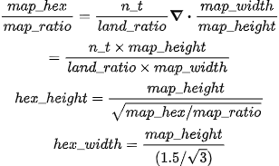

```{r setup, include=FALSE}
knitr::opts_chunk$set(echo = TRUE)
```

\frac{map\_hex}{map\_ratio} = \frac{n\_t}{land\_ratio} \div \frac{map\_width}{map\_height} \\* = \frac{n\_t \times map\_height}{land\_ratio \times map\_width} 

\\* hex\_height = \frac{map\_height}{\sqrt{map\_hex / map\_ratio}}

\\* hex\_width = \frac{map\_height}{(1.5/\sqrt{3})}



```{r eval=FALSE}
# measures for the map
## Calculate the width of map
map_width <- diff(unname(st_bbox(object))[c(1, 3)])
## Calculate the height of map
map_height <- diff(unname(st_bbox(object))[c(2, 4)])
## Calculate the area of map
map_area <- st_area(st_as_sfc(st_bbox(object)))
## Calculate the map width and height ratio
map_ratio <- map_width / map_height


## Total land area
land_area <- sum(st_area(object))
## Compute land to map ratio
land_ratio <- as.numeric(land_area / map_area)

# Number of hexagons to tile map such that ~n_tiles hexagons overlap land
map_hex <- n_tiles / land_ratio

# Size of hexagons
hex_height <- map_height / sqrt(map_hex / map_ratio)
hex_width <- hex_height / (1.5 / sqrt(3))
```

