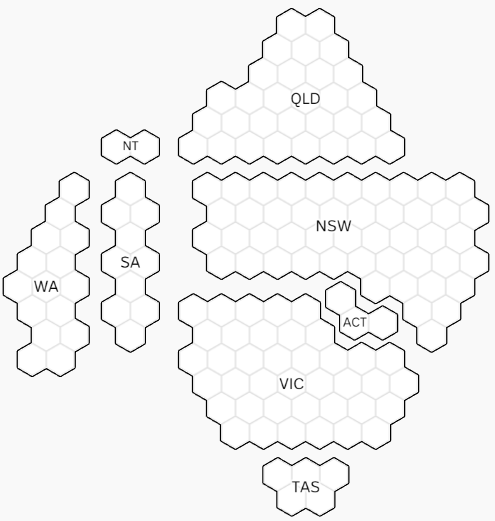

```{r setup, include=FALSE}
knitr::opts_chunk$set(echo = TRUE)
Sys.setlocale("LC_ALL","English")
```

# Introduction

## Motivation

> Australian Election Post  - [ABC](https://www.abc.net.au/news/2022-05-20/federal-election-map-lying/101076016)

> It is a contiguous cartogram as a whole, yet non-contiguous on the display.





> Goal -> To obtain a similar output


# Research results (ongoing)


## Relevant literature reviews

### 1. A Hexagon Tile Map Algorithm for Displaying Spatial Data     
by Stephanie Kobakian, Dianne Cook, and Earl Duncan

Relevant R package: `sugarbag` ([github](https://github.com/srkobakian/sugarbag))

> Maps may illustrate and lead to misunderstanding or misleading statical information display.


Example: 


> Possible solutions: alternative cartograms based on the orignial geographical map


> Output from the `sugerbag` package on AU Census data


### 2. Malaysia Election Data Visualization Using Hexagon Tile Grid Map ([2018](https://link.springer.com/chapter/10.1007/978-981-13-3441-2_28#Sec3))


## Relevant R packages & online News/Posts

### R package - `geogrid` ([github](https://github.com/jbaileyh/geogrid))

_**`C++` -> core calculating algorithm for minimizing the total distance between the centroid of every original geography and its new centroid on the grid ([Hungarian algorithm](https://en.wikipedia.org/wiki/Hungarian_algorithm)) + `R` **_


> Example: UK - London boroughs


> Example: US States


### R package - `tilemaps` ([github](https://github.com/kaerosen/tilemaps))


> US data


### Tilegrams - ([2016](https://github.com/JoshData/why-use-cartograms))

> US Election data, mainly JavaScript.


### Fivethirtyeight Post [github](https://github.com/JoshData/why-use-cartograms)

> 2016 US Election data, mainly Python.         
Using Albers equal-area conic projection


### The Guardian - Hexmap examples for UK election

  * [The Guardian - UK 2015 general election](https://www.theguardian.com/politics/ng-interactive/2015/may/07/live-uk-election-results-in-full)         
  * [The Guardian - UK 2017 general election](https://www.theguardian.com/politics/ng-interactive/2017/jun/08/live-uk-election-results-in-full-2017)


### UK Election 2017 - [Bloomberg](https://www.bloomberg.com/graphics/2017-uk-election/)


