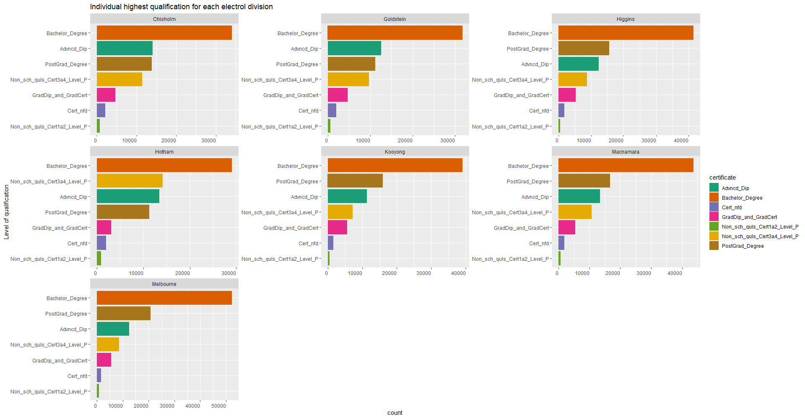

```{r setup, include=FALSE}
knitr::opts_chunk$set(echo = F, warning = F)
Sys.setlocale("LC_ALL","English")
```

```{r}
library(tidyverse)
library(sf)
library(eechidna)
library(tidytext)
library(unglue)
library(kableExtra)
```

# 2016 Census Data (2016)

> Reference [R pcakge `eechidna`](https://github.com/jforbes14/eechidna)

```{r}
data(abs2016)
abs2016 <- as_tibble(abs2016)
```


## Unemployment


```{r}
ggplot(data = abs2016,
       aes(x = Unemployed)) + 
  geom_density(fill = "salmon", 
               bw = "SJ",
               colour = NA) + 
  geom_rug(colour = "salmon") +
  theme_minimal() +
  xlim(0, 12)+
  labs(title = "Overal Unemployment (%)")
```

```{r}
ggplot(data = abs2016,
       aes(x = reorder(State, -Unemployed),
           y = Unemployed,
           colour = State)) + 
  geom_boxplot() + 
  labs(x = "State",
       y = "% Unemployment",
       title = "Unemplotment by States") + 
  theme_minimal() + 
  theme(legend.position = "none")
```


## Age


```{r}
abs2016 %>%
  select(starts_with("Age"), 
         DivisionNm) %>%
  gather(key = "Age",
         value = "Percent_in_electorate",
         -DivisionNm) %>% 
  ggplot(data = .,
         aes(x = reorder(Age, - Percent_in_electorate),
             y = Percent_in_electorate,
             colour = Age)) +
  geom_boxplot() + 
  coord_flip() + 
  theme_minimal() + 
  theme(legend.position = "none") +
  labs(x = "Age Groups",
       y = "% in Electorate")
```

## Income (Personal)

```{r}
ggplot(data = abs2016,
       aes(x = MedianPersonalIncome)) + 
  geom_density(fill = "salmon",
               bw = "SJ",
               colour = NA) + 
  xlim(250,1100) +
  geom_rug(colour = "salmon") + 
  theme_minimal()
```

```{r}
ggplot(data = abs2016,
       aes(x = reorder(State, -MedianPersonalIncome),
           y = MedianPersonalIncome,
           colour = State)) + 
  geom_boxplot() + 
  theme_minimal() + 
  theme(legend.position = "none") + 
  labs(x = "State")
```

```{r}
ggplot(data = abs2016,
       aes(x = reorder(State, -MedianPersonalIncome),
           y = MedianPersonalIncome,
           colour = State)) + 
  geom_boxplot() + 
  geom_jitter(alpha = 0.35, 
              size = 2,
              width = 0.3) +
  theme_minimal() + 
  theme(legend.position = "none") + 
  labs(x = "State")
```

## Map (using 2022 Census data)


### Selected Person Characteristics (SPC - GeoPackage A)


```{r spca}
vic_map <- read_sf(here::here("data/vic-july-2021-esri/E_VIC21_region.shp"))

sa1_geomap_spca <- read_sf(here::here("data/census2016_spca_vic_short.gpkg"), layer = "census2016_spca_vic_sa1_short")%>%
  mutate(centroid = map(geom, st_centroid),
  centroid = st_as_sfc(centroid, crs = st_crs(vic_map)),
  which = as.integer(st_intersects(centroid, vic_map)),
  Elect_div = ifelse(is.na(which), "None",
  vic_map$Elect_div[which])) %>% 
  filter(Elect_div %in% c("Chisholm", "Goldstein", "Higgins", "Hotham", "Kooyong", "Macnamara", "Melbourne"))
```

```{r}
sa1_spca_pop <- sa1_geomap_spca %>% 
  select(sa1_7digitcode_2016, Tot_P_P, Elect_div) %>% 
  group_by(Elect_div) %>%
  summarise(Total_population = sum(Tot_P_P), .groups= "drop") %>% 
  arrange(desc(Total_population)) %>% 
  select(c(Elect_div, Total_population)) %>% 
  st_set_geometry(NULL) %>% 
  kable(col.names= c("Electoral Division", "Total Population"), 
      align = 'c',
      caption = "Total population for each electoral division") %>% 
  kable_styling(bootstrap_options = c("striped", "hover"))

sa1_spca_pop
```

```{r}
sa1_spca_age <-sa1_geomap_spca %>% 
  select(Elect_div, Age_yr_0_P : Age_yr_79_P) %>%
  st_set_geometry(NULL) %>% 
  pivot_longer(cols = "Age_yr_0_P" : "Age_yr_79_P",
               names_to = "yr",
               values_to = "count") %>% 
  filter(str_detect(yr, "P")) %>% 
  unglue_unnest(yr, "Age_yr_{age=(\\d+|more)}_P")

sa1_age <- sa1_spca_age %>% 
  na.omit() %>% 
  mutate(percentage = count/sum(count)*100,
         age = as.numeric(age))

ggplot(sa1_age, aes(x = age, y = percentage, fill = Elect_div)) +
  geom_col() +
  facet_grid(Elect_div~.) +
  labs(x = "Age",
       y = "Percentage",
       title = "Age Distribution of Electoral Division") +
  scale_fill_brewer(palette = "Dark2")
```


### Education and Qualifications (EQ - GeoPackage A)



```{r eqa}
sa1_geomap_eqa <- read_sf(here::here("data/census2016_eqa_vic_short.gpkg"), layer = "census2016_eqa_vic_sa1_short")%>%
  mutate(centroid = map(geom, st_centroid),
  centroid = st_as_sfc(centroid, crs = st_crs(vic_map)),
  which = as.integer(st_intersects(centroid, vic_map)),
  Elect_div = ifelse(is.na(which), "None",
  vic_map$Elect_div[which])) %>% 
  filter(Elect_div %in% c("Chisholm", "Goldstein", "Higgins", "Hotham", "Kooyong", "Macnamara", "Melbourne"))
```

```{r}
sa1_eqa <- sa1_geomap_eqa %>% 
  select(Elect_div, contains("_P")) %>% 
  rename("PostGrad_Degree" = "Non_sch_quals_PostGrad_Dgre_P",
         "GradDip_and_GradCert" = "Non_sch_quals_Gr_Dip_Gr_Crt_P",
         "Bachelor_Degree" = "Non_sch_quals_Bchelr_Degree_P",
         "Advncd_Dip" = "Non_sch_quls_Advncd_Dip_Dip_P",
         "Cert_nfd" = "Non_sch_quls_Certnfd_Level_P") %>% 
  pivot_longer(cols = "PostGrad_Degree" : "Cert_nfd",
               names_to = "certificate",
               values_to = "count") %>% 
  select(Elect_div, certificate, count) %>% 
  na.omit()
```

```{r fig.align='center', fig.width=120%}
sa1_eqa %>% 
  mutate(certificate = as.factor(certificate),
         Elect_div = as.factor(Elect_div)) %>% na.omit %>% 
  mutate(certificate_new = reorder_within(certificate, count, within = Elect_div)) %>% 
  ggplot(aes(x = certificate_new, y = count, fill = certificate)) +
  geom_col() +
  labs(x = "Level of qualification",
       title = "Individual highest qualification for each electrol division") +
  theme(axis.text.x = element_text(angle=0, hjust=1))+
  coord_flip()+
  scale_x_reordered()+
  facet_wrap(~Elect_div, scales = "free")+
  scale_fill_brewer(palette = "Dark2")
```


