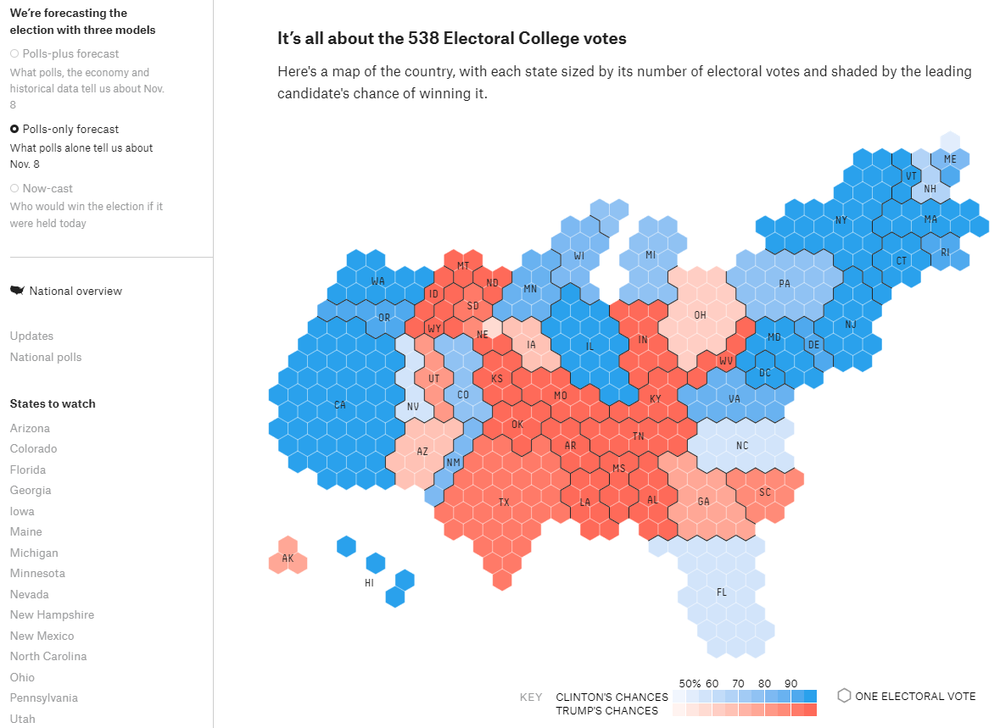

```{r setup, include=FALSE}
knitr::opts_chunk$set(echo = TRUE)
Sys.setlocale("LC_ALL","English")
```


# Summary of relevant articles/packages

## 1. [tilegrams](https://github.com/PitchInteractiveInc/tilegrams) - `22/09/2016`

  * [Blog](http://pitchinteractive.com/latest/tilegrams-more-human-maps/)      
  * [Package Manual](https://github.com/PitchInteractiveInc/tilegrams/blob/master/MANUAL.md)       
  * [Google News Lab Post](https://medium.com/google-news-lab/tilegrams-make-your-own-cartogram-hexmaps-with-our-new-tool-df46894eeec1) 
  * [NPR US Election Post](https://www.npr.org/2022/06/30/1107868327/trump-election-fraud-jan-6)
  
  * __Package Briefing__           
    * Mainly using data from US.       
    * With existing tilegrams:         
        1. Will provide some existing tilegrams for user exploration (US map). Users can export the SVG files and the [TopoJSON](https://github.com/topojson/topojson-specification/blob/master/README.md) into web application for customized display.      
        2. Moving tiles in single, a range or a specific region with highlight of each region on the sidebar area.     
        3. Users can remove or add a tile on the map.     
        4. The statistical accuracy of the display is summarized an indicator "delta". If it is positive, it represents the region has too many tiles than it should have, vice versa.

    * Generating new tilegrams:     
        1. Users can select from a few prepared data sets or input their own CSV (in a specified format using US FIPS codes). It will start from a conventional geographic map then resizing the regions to the selected data.     
        2. Users can adjust the number of value for each tile manually or using the `Resolution` slider.    
        * Need to alter the `delta` to `0` to make reasonable tilegrams for inferring.    

**_How does the computation of delta works?_**      

  - Calculated the proposed number of tiles of each region based on the population (`500,000 per tile`), then compute the difference between the data sets to obtain `delta` value.     
  
  * Relevant codes (JavaScript) - [Cartogram](https://github.com/PitchInteractiveInc/tilegrams/blob/efdfad1f3206856d47d85604c85f0032f2f2e448/source/Canvas.js#L26-L31), [Tiles](https://github.com/PitchInteractiveInc/tilegrams/blob/efdfad1f3206856d47d85604c85f0032f2f2e448/source/graphics/GridGraphic.js#L308-L328)


## 2. Fivethirtyeight [Examples](https://projects.fivethirtyeight.com/facebook-primary/) 

  *      
  
  * [fivethirtyeight-2016 US Election Post](https://projects.fivethirtyeight.com/2016-election-forecast/)
  * [Author Post](https://medium.com/civic-tech-thoughts-from-joshdata/how-that-map-you-saw-on-538-under-represents-minorities-by-half-and-other-reasons-to-consider-a-4a98f89cbbb1) - Methodology in it.         
  * [358 Map Github link](https://github.com/JoshData/why-use-cartograms)     
  * Using [Albers equal-area conic projection](https://en.wikipedia.org/wiki/Albers_projection)        
  * Calculating the number of pixels used by original geographic map, then computing the actual pixels display based on the population of the region.     


## 3. The Guardian - Hexmap examples for UK election

  * [The Guardian - UK 2015 general election](https://www.theguardian.com/politics/ng-interactive/2015/may/07/live-uk-election-results-in-full)         
  * [The Guardian - UK 2017 general election](https://www.theguardian.com/politics/ng-interactive/2017/jun/08/live-uk-election-results-in-full-2017)        
  
  
## 4. uk-hex-cartograms-noncontiguous - [Github](https://github.com/houseofcommonslibrary/uk-hex-cartograms-noncontiguous#uk-hex-cartograms-noncontiguous)     

  * __Package Briefing__      
    * Load any of the geopackage files into a GIS program like `QGIS`. The project CRS should be set to EPSG:27700 (British National Grid) in order for the layers to display correctly. To visualise data you will need to join data to the relevant cartogram layer (e.g. MSOA, LTLA 2018) using the [normal method](https://www.qgistutorials.com/en/docs/3/performing_table_joins.html).   
    
    * Non-contiguous cartogram formation:     
    
      1. The areas will be grouped by ceremonial county of English and other recognisable sub-national geographical areas.      
      2. These groups are resized based on their population - directly (as in the local authority and constituency versions) or indirectly (as in MSOA version, i.e. one hexagon represents one MSOA).     
      3. These groups will be separated and arranged according to the approximate geographic location to result a shape resembles the UK.

    * The exact shape for each group differs between the four versions of the template because of the different subdivisions within county groups (e.g. MSOAs, local authorities).      
      
      * In the MSOA version, MSOAs are arranged approximately geographically within the wider local authority shape, according to the relative position of their [population-weighted](https://geoportal.statistics.gov.uk/datasets/b0a6d8a3dc5d4718b3fd62c548d60f81_0/explore?location=52.910974%2C-2.000000%2C7.38) centroid. Note that the MSOA version only includes England and Wales because Scotland and Northern Ireland have different, non-equivalent census geographical divisions.
      * The MSOA cartogram was made by aligning [MSOA population-weighted centroids](https://geoportal.statistics.gov.uk/datasets/b0a6d8a3dc5d4718b3fd62c548d60f81_0/explore) to a hex grid in QGIS. This involved manual work to get an arrangement that was both geographically acceptable and aesthetically acceptable. 
      The other versions were produced by iterating on the MSOA version - by adding and removing hexagons as required to produce the correct population equivalent for each area, and then re-arranging the shapes.        
      * The templates are most useful for data about `people and populations`, because they resized based on the population.       
      * The background shape of the British Island can be disabled, when it is on, the separated islands (such as  "Isles of Wight, Anglesey, and Arran") will be included as it represents the outer border of the visualization area.      
  

    * Alternative cartogram - [UK General Election 2019](https://visual.parliament.uk/research/visualisations/general-election-2019-constituencies/?map=party)
    

## 5. [Bloomberg](https://www.bloomberg.com/graphics/2017-uk-election/) - U.K. Election 2017


## 6. Literature Review   

  * [Malaysia Election Data Visualization Using Hexagon Tile Grid Map](https://link.springer.com/chapter/10.1007/978-981-13-3441-2_28#Sec3)       
    * Set up 4 files: 1. `setting.json`, 2. `parliament.json`, 3. `election.json`, 4. `demographic.json`      
    1. Setting up the settings for the SVG elements, hexagon radius, tooltip functionality and colors used.       
    2. Using the `parliament.json` file to set up each hexagon to represent each parliament by states (it has unique information such parliament code and coordinate of the hexagon).        
    3. The unique key (i.e. "parliament code") will find the election data related to the parliament in `election.json` (it contains the actual election data for each parliament, such as voting and party information), then populate the hexagons for each particular parliament area.         
    4. `demographic.json` will have both state and the corresponding parliaments demographic information, which will be incorporated with these three files (using `d3.json()` function).     


# R package 

`geogrid` ([github](https://github.com/jbaileyh/geogrid))
 
 **`C++` -> core calculating algorithm for minimizing the total distance between the centroid of every original geography and its new centroid on the grid ([Hungarian algorithm](https://en.wikipedia.org/wiki/Hungarian_algorithm)) + `R` **
  
  * Limitations:         
   1. The calculation time for a large data set will be considerable long as the calcultion will try to find the minimum distance between the new centroid and the orignial ones. 
   
   2. The core algorithm (__*Hungarian algorithm*__) is written in C++, so object optimization should be implemented to boost the calculation efficiency.        
   
   3. Before the calculation of number of hex tiles for the grid, the grid generation process need to be evaluated (i.e. choose which `seed` to use for the `assign_ploygons`). The process may be time-consuming as the calculation iss*ue for big data processing (i.e. above two points*).
   
   4. The output hex-map will only allocate one hex tile to a particular region/area to fill the hex grid, which creates two crucial issues: 1. It may not be applicable to data sets that have multiple objects in one particular region such as the 2022 AU election data. 2. The location / allocation of the hexagons may not be accurate due to the calculation algorithm issue.     


`tilemaps` ([github](https://github.com/kaerosen/tilemaps))

  * The core algorithm used is [Generating Tile Maps](https://onlinelibrary.wiley.com/doi/abs/10.1111/cgf.13200#:~:text=To%20generate%20multiple%20tile%20maps,well%20as%20their%20boundary%20roughness.).

  * Limitations:
  
    1. The algorithm can only produce a single hex-tile for each area, and the allocation of the hex-tile to the geographical locations may not be accurate if there are multiple sub-areas for that particular region.
    
    2. This package can only output a contiguous cartogram, and have to manually allocate the separate geographical locations alongside with the main map.


